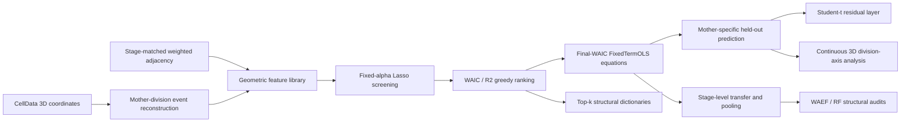

# Interpretable *C. elegans* Cell-Division Geometry

A reproducible reference implementation for modeling early *C. elegans* daughter-cell geometry with **FixedTermOLS**, **weighted cell-contact adjacency**, **lineage-level structural dictionaries**, **heteroscedastic heavy-tailed residuals**, and **continuous 3D division-axis statistics**.

This repository organizes two complementary resolutions of the same project:

1. **Stage-level structural dynamics** — asks which geometric structures can be reused across developmental stages and whether their numerical coefficients transfer.
2. **Mother-specific division geometry** — fits one model per mother-division type, evaluates it on held-out embryos, and separates typical geometry from embryo-to-embryo variation.

The central empirical message is:

> **Geometric structure is more reusable than numerical coefficients.**  
> Mean targets mainly describe center transport, while half targets are more strongly modulated by weighted neighborhood geometry. At the finer mother-specific level, the model recovers stable dominant division axes and division-length trends, while residual modeling is still needed for individual-embryo variability.



---

## 1. Why this repository has two modeling resolutions

The project evolved from a stage-pooled analysis to a finer mother-specific analysis. These two analyses should **not** be interpreted as duplicate estimates of the same quantity.

| Resolution | Statistical unit | Evaluation style | Main question |
|---|---|---|---|
| Stage-level | all division events inside one developmental block | descriptive within-stage fitting + transfer/pooling experiments | What geometric structures are reusable across stages? |
| Mother-specific | one mother-division type across repeated embryos | independent 70% train / 30% held-out test within each mother | How reproducible is the geometry of a specific division, and what uncertainty remains? |

This distinction matters because the stage-level fits can have high within-stage \(R^2\), whereas the mother-specific half-coordinate held-out problem is substantially harder. The repository therefore keeps both analyses explicit instead of mixing their scores.

---

## 2. Data representation

For daughters

\[
d_1=(x_1,y_1,z_1),\qquad d_2=(x_2,y_2,z_2),
\]

we use six regression targets:

\[
x_{\mathrm{mean}}=\frac{x_1+x_2}{2},\qquad
x_{\mathrm{half}}=\frac{|x_1-x_2|}{2},
\]

with the same definitions for \(y\) and \(z\).

Equivalently,

\[
c=(x_{\mathrm{mean}},y_{\mathrm{mean}},z_{\mathrm{mean}})^\top,
\qquad
h=(x_{\mathrm{half}},y_{\mathrm{half}},z_{\mathrm{half}})^\top.
\]

- `mean` targets describe the daughter-pair center.
- `half` targets describe coordinate-wise separation amplitude.

The current mother-specific analysis contains **4,056 mother-event observations**, **20 mother-division types**, and **120 final equations** (20 mothers × 6 targets).

---

## 3. Weighted adjacency features

For a mother \(m\) and a stage-matched weighted contact matrix with weights \(w_{mj}\), neighbor summaries use the original continuous weights:

\[
\langle x_j^k\rangle_w
=
\frac{\sum_j w_{mj}x_j^k}{\sum_j w_{mj}},
\]

\[
\langle (x_j-x_m)^k\rangle_w
=
\frac{\sum_j w_{mj}(x_j-x_m)^k}{\sum_j w_{mj}}.
\]

The candidate library combines:

- mother coordinates and low-order mother polynomials;
- weighted neighbor moments;
- weighted relative-displacement moments;
- mother-neighbor coupling terms;
- WAEF primitives: weighted degree, displacement, and local spread.

The main reported analysis **does not binarize the adjacency weights**.

---

## 4. FixedTermOLS

For a mother \(m\), target \(a\), and selected term set \(S_{m,a}\), the final equation is a no-intercept linear model:

\[
\widehat y_{m,a}
=
\sum_{k\in S_{m,a}}\beta_{m,a,k}\phi_k(X).
\]

Selection is deliberately separated into two roles.

### 4.1 Fixed-\(\alpha\) Lasso screening

The mother-specific pipeline retains a **Top-40** candidate pool. The stage-level analysis uses a **Top-20** candidate pool.

### 4.2 WAIC/\(R^2\) greedy path

From the remaining candidates, each step chooses the term maximizing

\[
S=
\frac12
\frac{\max(\Delta R^2,0)}{\max\Delta R^2+10^{-12}}
+
\frac12
\frac{\max(\Delta \mathrm{WAIC},0)}{\max\Delta \mathrm{WAIC}+10^{-12}},
\]

where positive \(\Delta\mathrm{WAIC}\) means a reduction in WAIC. The mother-specific path is kept to at most 15 terms.

The final prediction equation uses the **training-set WAIC minimum** along the greedy path. The deeper `Top-5/8/12/15` profiles are retained separately for structural-dictionary comparisons.

This avoids forcing all 15 ranked terms into the final predictive model.

---

## 5. Mother-specific analysis: main reported findings

### 5.1 Weighted neighborhood geometry dominates half-equation structure

Across the 60 final half equations:

- weighted-adjacency terms account for about **70.8% of selected terms**;
- their standardized contribution share, measured by \(|\beta_j|\,\mathrm{SD}(\phi_j)\), is about **62.0%**.

Frequently reused Top-15 structures include weighted second- and third-order neighbor moments, relative displacements, and mother-neighbor couplings.

### 5.2 Lineage signal is a dictionary-level effect, not a single marker

For the union of Top-15 terms across the three half targets:

- mean Jaccard within the same root lineage: **0.3918**;
- mean Jaccard across different roots: **0.3694**;
- nominal one-sided permutation \(p\approx 0.0304\);
- after correction across four profile depths, \(q\approx 0.1216\).

We therefore treat lineage association as **exploratory structural evidence**, not as proof of a stable lineage-specific single term.

### 5.3 Mean equations retain same-axis mother coordinates

The first-order same-axis mother coordinate enters final equations repeatedly:

| Target | Same-axis first-order term in final equation | Mean standardized contribution of that term |
|---|---:|---:|
| \(x_{\mathrm{mean}}\) | 60% | 15.77% |
| \(y_{\mathrm{mean}}\) | 40% | 9.32% |
| \(z_{\mathrm{mean}}\) | 40% | 8.60% |

This supports the interpretation of `mean` as daughter-pair center transport/calibration, whereas `half` more directly reflects local division geometry.

### 5.4 Heteroscedastic heavy-tailed residual layer

For half-target residuals,

\[
\epsilon_{i,m,a}=y_{i,m,a}-\widehat y_{i,m,a},
\qquad
\sigma_{m,a}=\mathrm{RMSE}_{\mathrm{train}}(m,a),
\]

the standardized residuals are summarized by the reported model

\[
\frac{\epsilon_{i,m,a}}{\sigma_{m,a}}
\sim t_{13}(0,1.08).
\]

Cross-axis standardized residual correlations are small (approximately 0.026, 0.082, and -0.001), supporting an approximate conditional-independence description for the three half residuals.

### 5.5 Continuous 3D division axes

For each event,

\[
v=d_1-d_2,\qquad u=\frac{v}{\|v\|},
\]

where \(u\) and \(-u\) represent the same undirected axis. For a mother with events \(u_i\), define

\[
M=\frac1n\sum_i u_i u_i^\top,
\]

and let \(\lambda_1\) be the largest eigenvalue. The axial strength is

\[
A=\frac{3\lambda_1-1}{2}.
\]

Reported results:

- median true mother axial strength: **0.955**;
- held-out event-level true/predicted axis-angle median: **7.44°**;
- **86.6%** of held-out events are within 15°;
- median predicted/true division-length ratio: **0.997**;
- **90.5%** of length ratios fall in \([0.8,1.2]\);
- mother-level dominant-axis true/predicted angle median: **1.39°**;
- **19/20** mothers are below 5°.

The predicted axis cloud is more concentrated than the true cloud (median axial strength 0.991 vs 0.955), indicating that the model recovers the typical axis but underestimates embryo-to-embryo directional variation.

---

## 6. Stage-level structural analysis: main reported findings

The stage-level model groups events into five developmental blocks: `4-8`, `8-12`, `12-14`, `14-15`, and `15-24`.

### 6.1 Half-vector structural form

The three half equations can be organized as

\[
\widehat h^{(s)}
=
A_sQ
+
B_s(x_m,y_m,z_m)\mu
+
C_s(x_m,y_m,z_m)M
+
p_s(x_m,y_m,z_m),
\]

where:

- \(Q\): local spread;
- \(\mu\): weighted neighborhood center;
- \(M\): higher-order neighborhood moments;
- \(p_s\): mother-axis polynomial/coupling terms.

A recurrent conditional motif is \(Q_y\to x_{\mathrm{half}}\), but it is interpreted as a **multivariable geometric motif**, not a universal univariate causal law.

### 6.2 Structure transfers; coefficients do not

Off-diagonal cross-stage summaries reported in the stage-level study are:

| Transfer mode | Mean-target \(R^2\) | Half-target \(R^2\) | All-target \(R^2\) |
|---|---:|---:|---:|
| Direct coefficient transfer | -7.263 | -137.451 | -72.357 |
| Transfer selected structure + destination refit | 0.784 | 0.244 | 0.514 |

This is the strongest evidence for the project-wide conclusion that the reusable object is the **structural dictionary**, while coefficients remain stage dependent.

### 6.3 Pooling stages is useful only with stage-specific coefficients

For all five stages pooled together:

| Model | All-target \(R^2\) | Half-target \(R^2\) | 3D position RMSE |
|---|---:|---:|---:|
| Self-stage FixedTerm | 0.897 | 0.811 | 1.631 |
| Shared coefficients | 0.810 | 0.660 | 2.254 |
| Shared slopes + stage indicator | 0.859 | 0.750 | 1.980 |
| **Shared dictionary + stage-specific coefficients** | **0.904** | **0.822** | **1.549** |

The improvement is small in \(R^2\) but consistent, and the 3D position error improves more clearly.

---

## 7. WAEF: a low-dimensional complementary model

`WAEFRegressor` implements a clean reference version of **Weighted-Adjacency Effective-Field Regression**.

The primitive vector is

\[
(x_m,y_m,z_m,d,\Delta_x,\Delta_y,\Delta_z,Q_x,Q_y,Q_z),
\]

RMS-standardized without centering and compressed into a unit-norm effective field

\[
u=\sum_r w_r v_r^*,\qquad \sum_r w_r^2=1.
\]

The stage-level study used:

- signed linear response for `mean` targets;
- exponential response for \(x_{\mathrm{half}}\);
- logistic response for \(y_{\mathrm{half}}\);
- absolute-field logistic response for \(z_{\mathrm{half}}\).

WAEF can approach FixedTermOLS within several stages, but direct cross-stage transfer is unstable. It is therefore treated as a **compression/interpretation model**, not as a replacement for the explicit FixedTerm equations.

---

## 8. Repository layout

```text
celegans-division-geometry/
├── README.md
├── LICENSE
├── CITATION.md
├── pyproject.toml
├── requirements.txt
├── configs/
│   ├── mother.yaml
│   └── stage.yaml
├── data/
│   └── README.md
├── docs/
│   ├── DATA_FORMAT.md
│   ├── METHODS.md
│   ├── REPRODUCIBILITY.md
│   ├── RESULTS_SUMMARY.md
│   └── PROJECT_SUMMARY_CN.md
├── scripts/
│   ├── convert_adjacency_workbook.py
│   ├── make_synthetic_demo.py
│   ├── run_mother_pipeline.py
│   └── run_stage_pipeline.py
├── src/celegans_geometry/
│   ├── adjacency.py
│   ├── audit.py
│   ├── axis.py
│   ├── constants.py
│   ├── features.py
│   ├── fixedterm.py
│   ├── io.py
│   ├── lineage.py
│   ├── metrics.py
│   ├── mother_models.py
│   ├── residuals.py
│   ├── stage_models.py
│   ├── targets.py
│   └── waef.py
└── tests/
```

---

## 9. Installation

Python 3.10+ is recommended.

```bash
git clone <your-github-url>
cd celegans-division-geometry

python -m venv .venv
source .venv/bin/activate        # Windows: .venv\\Scripts\\activate
pip install -e .
```

For development:

```bash
pip install -e ".[dev]"
pytest
```

---

## 10. Quick smoke test

Generate a synthetic CellData-style early-embryo dataset:

```bash
python scripts/make_synthetic_demo.py --out data/demo
```

Run the mother-specific pipeline:

```bash
python scripts/run_mother_pipeline.py \
  --cell-data-root data/demo/CellData \
  --adj-dir data/demo/adj \
  --out results/demo_mother
```

This produces canonical events, features, train/test splits, final equations, ranked structural profiles, residual summaries, and continuous-axis metrics.

---

## 11. Running on the biological data

Place the source CellData CSVs (or the original CellData ZIP archives) under a local directory and the weighted adjacency matrices under another directory. The raw loader preserves archive/subdirectory identity, so repeated `CellData_0.csv` names from different source blocks do not collide. See [`data/README.md`](data/README.md) and [`docs/DATA_FORMAT.md`](docs/DATA_FORMAT.md).

If adjacency matrices are delivered in a stage-labeled Excel workbook, convert them first:

```bash
python scripts/convert_adjacency_workbook.py path/to/adjacency.xlsx --out data/adj
```

Mother-specific analysis:

```bash
python scripts/run_mother_pipeline.py \
  --cell-data-root data/raw \
  --adj-dir data/adj \
  --out results/mother \
  --lasso-alpha <FIXED_ALPHA>
```

Stage-level analysis:

```bash
python scripts/run_stage_pipeline.py \
  --cell-data-root data/raw \
  --adj-dir data/adj \
  --out results/stage \
  --lasso-alpha <FIXED_ALPHA> \
  --waef \
  --rf-audit
```

### Important reproducibility note

The two manuscripts specify a **fixed Lasso \(\alpha\)** but the numeric value is not encoded in the PDFs themselves. The code therefore exposes it as a required scientific configuration choice. The repository default (`0.001`) is a convenient reference value for smoke tests; **do not claim an exact archival reproduction until it is set to the original project value and the original split seed/input files are used**.

---

## 12. Leakage controls

The mother-specific pipeline is organized so that:

- each mother is split independently;
- the same mother-level train/test split is shared across its six targets;
- test rows do not participate in Lasso screening, greedy term selection, coefficient fitting, or sign-template fitting;
- residual scale \(\sigma_{m,a}\) is estimated from training residuals;
- deeper Top-k structural profiles are not automatically forced into the final predictive equation.

These distinctions are essential for interpreting the held-out results.

---

## 13. Reproducibility status

The project archive previously validated that the weighted-adjacency event-wise analysis produced:

- 4,056/4,056 events matched to adjacency information;
- 20 mother types;
- 120 final equations;
- 1,800 ranked entries (20 × 6 × 15);
- exact agreement between a fast orthogonal-projection greedy implementation and a refit-every-candidate OLS implementation on selected validation cases.

This GitHub package is a **clean reference implementation reconstructed from the two finalized analysis documents and the validated project conventions**. It is intentionally easier to read and maintain than the historical research notebooks. It should not be described as byte-for-byte identical to every archived notebook.

See [`docs/REPRODUCIBILITY.md`](docs/REPRODUCIBILITY.md) for details.

---

## 14. Known limitations

1. Stage-level within-stage scores are descriptive and should not be confused with mother-specific held-out performance.
2. The weighted adjacency matrices represent stage-level contact structure and do not capture embryo-specific dynamic contact-area fluctuations.
3. The absolute-half representation loses daughter-label signs; labeled 3D reconstruction therefore needs a training-only mother-specific sign convention.
4. The model underestimates event-to-event directional dispersion even when the dominant division axis is recovered accurately.
5. The Top-15 lineage signal is exploratory after multiple-testing correction.
6. WAEF is useful for compression and interpretation, but its effective-field direction is not a universal cross-stage invariant.

---

## 15. Citation and license

See [`CITATION.md`](CITATION.md). Once the manuscript is public, replace it with the final formal citation.

Code is released under the [MIT License](LICENSE). Biological source data are not included and remain subject to their original data-use terms.
