# Interpretable Stage-Dependent Equations for C. elegans Daughter-Cell Position Prediction

This repository presents an interpretable modeling pipeline for predicting daughter-cell positions from mother-cell and neighborhood geometry. The central result is that **FixedTermOLS learns a transferable structural dictionary, while the numerical coefficients are stage-specific and should be calibrated per stage**.

The repository is designed as an open-source explanation page: it emphasizes the modeling ideas, interpretable equations, stage-wise dynamics, transfer behavior, feature audit, and few-shot calibration results.

## Executive summary

- We represent each division event using six targets: three daughter-center coordinates and three half-separation coordinates.

- The final predictive model is a sparse, no-intercept **FixedTermOLS** equation for each stage and each target.

- The half-coordinate equations can be rewritten as a unified half-vector equation: $$\widehat h^{(s)}=A_sQ+B_s(m)\mu+C_s(m)M+p_s(m).$$

- Cross-stage experiments show that **selected structures transfer better than coefficients**: direct coefficient transfer fails, but feature transfer followed by destination-stage refitting works.

- Few-shot calibration shows that sparse FixedTerm structures are useful low-data priors.

- RandomForest is used only as a nonlinear feature audit. It supports the significance of structural feature blocks, but the main target-specific interpretation comes from FixedTermOLS.

## 1. Prediction target

For each division event, we predict two daughter-cell positions. Instead of predicting the two daughters directly, we use a center/half-vector representation:

$$
x_{\rm mean}=\frac{x_1+x_2}{2},\qquad x_{\rm half}=\frac{|x_1-x_2|}{2},
$$

and analogously for the $y$ and $z$ coordinates. The target vector is

$$
q=(x_{\rm mean},x_{\rm half},y_{\rm mean},y_{\rm half},z_{\rm mean},z_{\rm half}).
$$

This representation separates two geometric roles: **mean coordinates describe center transport**, while **half coordinates describe local division scale and separation geometry**.

### Stage summary

| stage | events | mother types | interpretation |
| --- | --- | --- | --- |
| 4-8 | 888 | 4 | early local-neighborhood stage |
| 8-12 | 872 | 4 | mixed local-global stage |
| 12-14 | 436 | 2 | neighbor-shape moment stage |
| 14-15 | 186 | 1 | short transition window |
| 15-24 | 1674 | 9 | late broad-structure dictionary stage |

## 2. Final model: FixedTermOLS

For each stage $s$ and target $t$, the final model is a sparse no-intercept equation:

$$
\widehat q_t^{(s)}=\sum_{k\in S_{s,t}}\beta_{s,t,k}\phi_k.
$$

The candidate features $\phi_k$ include mother-cell coordinate polynomials, neighbor raw moments, relative displacement/spread terms, and mother-neighbor couplings. FixedTermOLS is kept as the final model because it is sparse, readable, stable in 3D morphology, and admits a meaningful structural interpretation.

### In-stage performance summary

| stage | all-target mean R2 | mean-target mean R2 | half-target mean R2 | total selected terms |
| --- | --- | --- | --- | --- |
| 4-8 | 0.883 | 0.981 | 0.784 | 34 |
| 8-12 | 0.896 | 0.986 | 0.806 | 43 |
| 12-14 | 0.546 | 0.936 | 0.156 | 36 |
| 14-15 | 0.170 | 0.248 | 0.092 | 34 |
| 15-24 | 0.853 | 0.980 | 0.727 | 45 |

### 3D morphology check

The plots below compare true daughter-cell positions against FixedTermOLS predictions. Colors indicate mother-cell type, with the legend placed below each 3D figure.

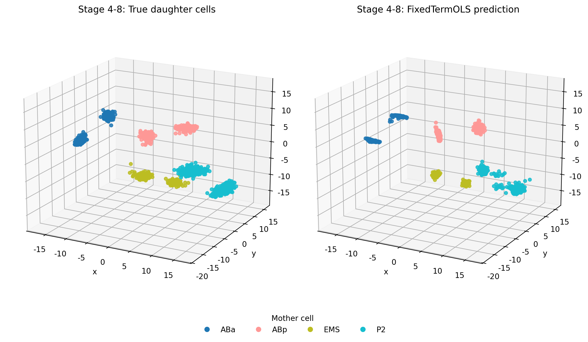

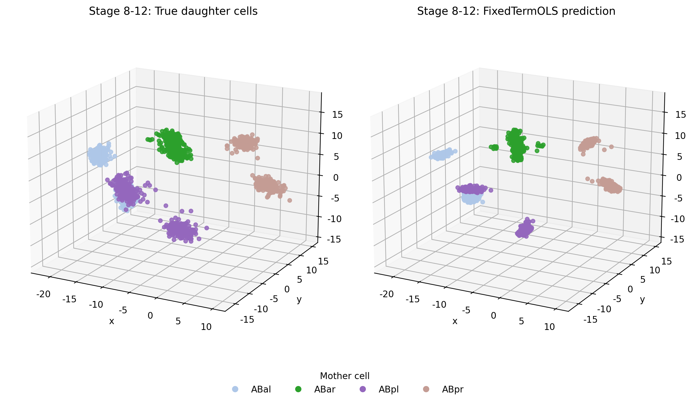

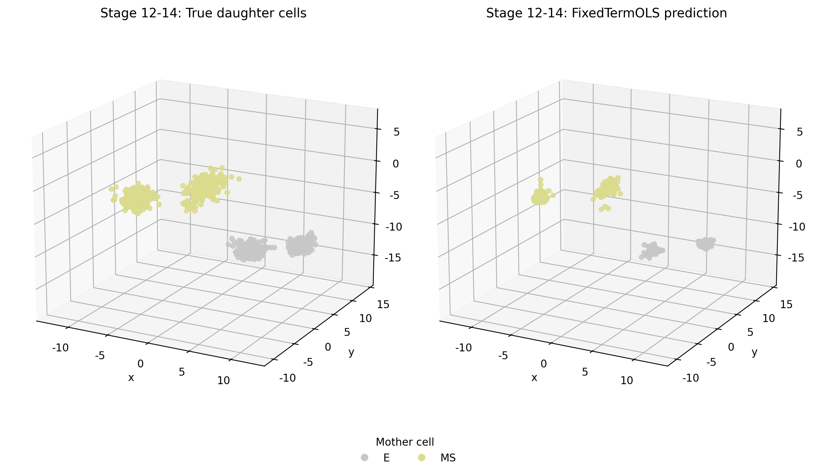

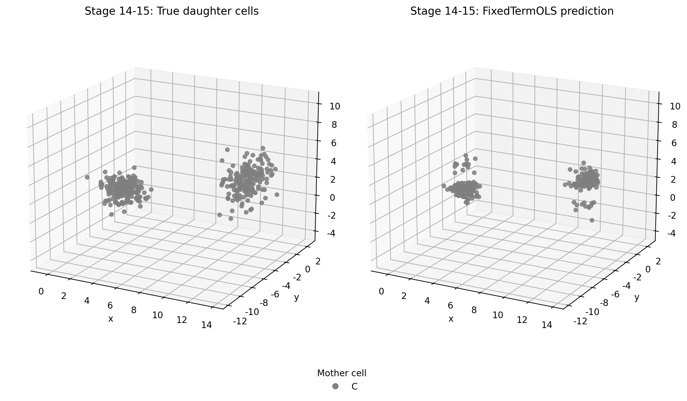

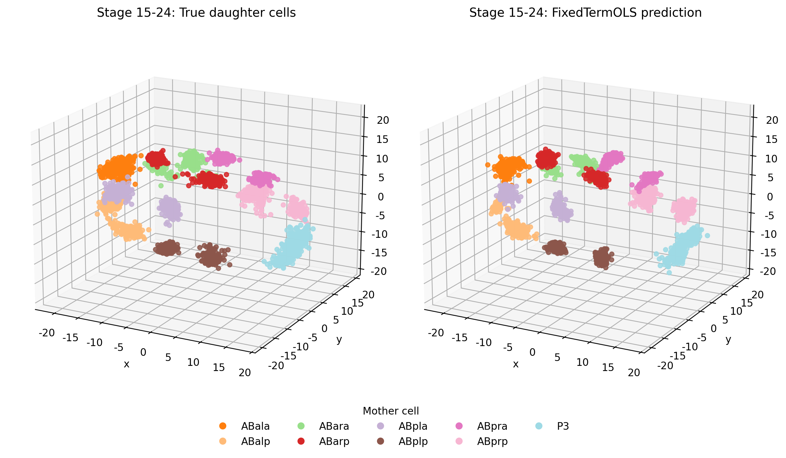

## 3. Two-stage model selection

The selection process has two explicit stages.

**Step 1: fixed-alpha Lasso screening.** Lasso is used to screen a Top-20 candidate list from the full feature library. For path visualization, the Lasso alpha is fixed to avoid artificial oscillations where adding features may lower R2 or increase WAIC simply because the regularization strength changed.

**Step 2: FixedTermOLS reorder.** The Top-20 candidates are then reordered by a stepwise FixedTermOLS path, tracking R2, MSE, and WAIC as terms are added. This means the final equations are not a direct copy of the Lasso order; they are produced by **screening first, reordering second**.

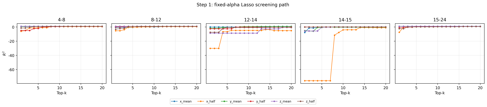

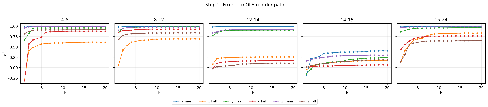

A stage-level example combines both views side by side:

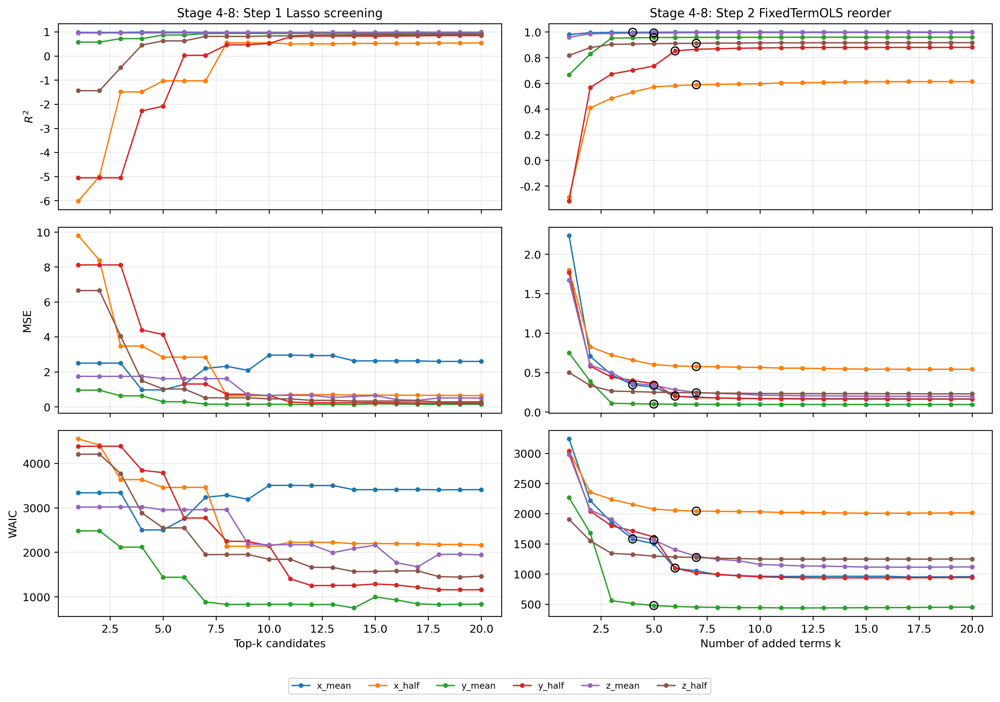

### Feature deletion experiment

To test whether an apparently simple term can influence the entire selection path, we remove a representative term, $m_x^2$, from the stage 4-8 $z_{\rm half}$ path. The original path is drawn as a solid line and the ablated path as a dashed line.

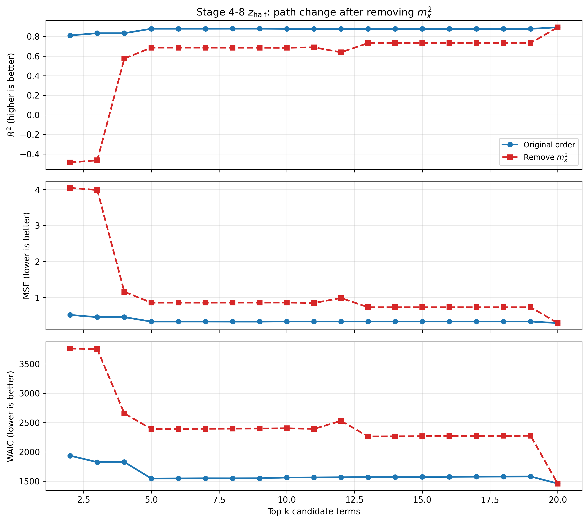

The ablated path deviates from the original across many values of $k$, showing that early terms change the marginal value of later terms. This supports interpreting FixedTermOLS terms as part of a path-dependent structural dictionary rather than isolated coefficients.

## 4. Full equations

All final equations are included in [`docs/all_fixedterm_equations.md`](docs/all_fixedterm_equations.md). Each equation is stage-specific and target-specific.

Show all FixedTermOLS equations in this README

### Stage 4-8

**x_mean**

$$
\begin{aligned}
\widehat{x_{\mathrm{mean}}} &= 1.03\,m_x + 0.02\,\langle x_j^2\rangle_N + 1.39\times 10^{-3}\,\langle x_j^3\rangle_N\\&\quad - 3.45\times 10^{-3}\,\langle m_xx_j^2\rangle_N
\end{aligned}
$$

**x_half**

$$
\begin{aligned}
\widehat{x_{\mathrm{half}}} &= - 1.85\times 10^{-3}\,m_z^2 + 5.21\times 10^{-3}\,\langle (x_j-m_x)^2\rangle_N + 0.11\,\langle (y_j-m_y)^2\rangle_N\\&\quad - 0.41\,\langle x_j\rangle_N + 0.01\,\langle x_j^2\rangle_N + 1.10\times 10^{-3}\,m_x^2m_z\\&\quad + 3.00\times 10^{-3}\,\langle (m_yy_j)^3\rangle_N
\end{aligned}
$$

**y_mean**

$$
\begin{aligned}
\widehat{y_{\mathrm{mean}}} &= - 0.23\,\langle x_j\rangle_N - 0.11\,m_x - 0.09\,m_z\\&\quad - 0.05\,m_ym_z - 1.08\times 10^{-3}\,\langle x_j^2\rangle_N
\end{aligned}
$$

**y_half**

$$
\begin{aligned}
\widehat{y_{\mathrm{half}}} &= 9.79\times 10^{-3}\,\langle (x_j-m_x)^2\rangle_N + 1.57\times 10^{-3}\,\langle m_xx_j^2\rangle_N + 2.15\times 10^{-3}\,m_xm_z^2\\&\quad + 9.44\times 10^{-4}\,\langle x_j^3\rangle_N + 8.69\times 10^{-3}\,\langle x_j^2\rangle_N + 0.05\,\langle m_xx_j\rangle_N
\end{aligned}
$$

**z_mean**

$$
\begin{aligned}
\widehat{z_{\mathrm{mean}}} &= 1.22\,m_z - 0.14\,\langle (y_j-m_y)^2\rangle_N + 6.56\times 10^{-3}\,m_xm_z^2\\&\quad + 0.01\,\langle m_z^2z_j\rangle_N + 2.95\times 10^{-3}\,(m_y-m_x)^2
\end{aligned}
$$

**z_half**

$$
\begin{aligned}
\widehat{z_{\mathrm{half}}} &= 9.56\times 10^{-3}\,m_x^2 + 0.02\,\langle m_xx_j\rangle_N + 3.04\times 10^{-3}\,\langle x_j^2\rangle_N\\&\quad - 0.02\,m_xm_z + 1.79\times 10^{-4}\,\langle (m_xx_j)^2\rangle_N + 2.07\times 10^{-5}\,(m_xm_y^2m_z)^2\\&\quad + 3.61\times 10^{-3}\,\langle y_j^3\rangle_N
\end{aligned}
$$

### Stage 8-12

**x_mean**

$$
\begin{aligned}
\widehat{x_{\mathrm{mean}}} &= 0.63\,m_x - 0.59\,\langle y_j\rangle_N + 1.09\,\langle x_j\rangle_N\\&\quad + 3.19\times 10^{-3}\,\langle m_zz_j^2\rangle_N - 3.96\times 10^{-3}\,m_xm_z
\end{aligned}
$$

**x_half**

$$
\begin{aligned}
\widehat{x_{\mathrm{half}}} &= 0.12\,\langle (y_j-m_y)^2\rangle_N - 0.06\,\langle z_j\rangle_N - 0.10\,m_y^2\\&\quad - 4.62\times 10^{-3}\,\langle m_zz_j^2\rangle_N + 9.51\times 10^{-3}\,\langle (x_j-m_x)^2\rangle_N - 0.01\,\langle y_j^3\rangle_N
\end{aligned}
$$

**y_mean**

$$
\begin{aligned}
\widehat{y_{\mathrm{mean}}} &= 1.00\,m_y + 0.01\,\langle m_zz_j^2\rangle_N + 4.37\times 10^{-3}\,\langle m_z^2z_j\rangle_N\\&\quad + 0.24\,\langle m_yy_j\rangle_N - 0.01\,m_ym_z^2 + 7.86\times 10^{-4}\,\langle x_j^3\rangle_N\\&\quad + 2.62\times 10^{-3}\,m_x^2 - 2.07\times 10^{-3}\,m_x^2m_y
\end{aligned}
$$

**y_half**

$$
\begin{aligned}
\widehat{y_{\mathrm{half}}} &= 7.49\times 10^{-3}\,(m_z-m_y)^2 - 0.01\,\langle x_j\rangle_N - 0.01\,m_ym_z\\&\quad + 0.18\,m_z - 1.04\times 10^{-3}\,\langle x_j^3\rangle_N - 1.44\times 10^{-3}\,m_xm_ym_z\\&\quad + 6.95\times 10^{-3}\,\langle m_z^2z_j\rangle_N + 3.51\times 10^{-4}\,\langle (m_zz_j)^2\rangle_N
\end{aligned}
$$

**z_mean**

$$
\begin{aligned}
\widehat{z_{\mathrm{mean}}} &= 0.16\,\langle z_j-m_z\rangle_N + 0.02\,(m_z-m_y)^2 - 0.11\,\langle x_j-m_x\rangle_N\\&\quad - 7.72\times 10^{-4}\,\langle x_j^3\rangle_N - 5.16\times 10^{-3}\,m_z^3 - 2.20\times 10^{-3}\,m_x^2m_z\\&\quad + 1.27\,m_z + 9.02\times 10^{-3}\,\langle x_j^2\rangle_N
\end{aligned}
$$

**z_half**

$$
\begin{aligned}
\widehat{z_{\mathrm{half}}} &= 0.06\,\langle z_j^2\rangle_N + 0.02\,m_xm_z + 7.25\times 10^{-3}\,m_x^2\\&\quad + 0.02\,m_ym_z - 3.09\times 10^{-3}\,(m_y-m_x)^2 + 9.85\times 10^{-3}\,\langle (z_j-m_z)^2\rangle_N\\&\quad + 0.01\,\langle m_z^2z_j\rangle_N + 9.51\times 10^{-4}\,m_x^2m_z
\end{aligned}
$$

### Stage 12-14

**x_mean**

$$
\begin{aligned}
\widehat{x_{\mathrm{mean}}} &= 3.71\times 10^{-4}\,\langle x_j^3\rangle_N + 1.44\,m_x - 8.92\times 10^{-3}\,m_x^3\\&\quad + 0.03\,(m_y-m_x)^2 - 4.83\times 10^{-3}\,m_xm_ym_z - 5.57\times 10^{-3}\,\langle y_j^3\rangle_N\\&\quad - 0.02\,\langle z_j^2\rangle_N + 7.55\times 10^{-3}\,m_xm_y^2
\end{aligned}
$$

**x_half**

$$
\begin{aligned}
\widehat{x_{\mathrm{half}}} &= 0.03\,\langle x_j^2\rangle_N + 0.03\,\langle (y_j-m_y)^2\rangle_N - 1.79\times 10^{-7}\,(m_xm_ym_z^2)^2\\&\quad + 2.86\times 10^{-3}\,\langle y_j^3\rangle_N
\end{aligned}
$$

**y_mean**

$$
\begin{aligned}
\widehat{y_{\mathrm{mean}}} &= 0.01\,\langle m_yy_j^2\rangle_N - 0.01\,m_xm_y + 0.05\,\langle z_j^2\rangle_N\\&\quad - 4.16\times 10^{-4}\,\langle x_j^3\rangle_N
\end{aligned}
$$

**y_half**

$$
\begin{aligned}
\widehat{y_{\mathrm{half}}} &= 7.09\times 10^{-3}\,\langle x_j^2\rangle_N + 0.04\,m_x + 6.48\times 10^{-3}\,\langle y_j^3\rangle_N\\&\quad - 2.67\times 10^{-6}\,\langle (m_zz_j)^3\rangle_N - 0.28\,\langle y_j\rangle_N
\end{aligned}
$$

**z_mean**

$$
\begin{aligned}
\widehat{z_{\mathrm{mean}}} &= 0.96\,m_z - 0.04\,\langle m_xx_j\rangle_N + 0.04\,m_z^2\\&\quad + 0.03\,m_xm_z - 3.06\times 10^{-6}\,(m_xm_z)^3 - 0.06\,\langle y_j^2\rangle_N\\&\quad - 0.05\,\langle m_y^2y_j\rangle_N
\end{aligned}
$$

**z_half**

$$
\begin{aligned}
\widehat{z_{\mathrm{half}}} &= 8.64\times 10^{-3}\,\langle x_j^2\rangle_N - 4.69\times 10^{-3}\,m_xm_z + 5.22\times 10^{-3}\,\langle z_j^2\rangle_N\\&\quad + 2.34\times 10^{-3}\,\langle y_j^3\rangle_N + 2.68\times 10^{-3}\,\langle z_j^3\rangle_N - 8.16\times 10^{-4}\,(m_ym_z)^2\\&\quad + 0.03\,m_y^2 - 0.22\,\langle z_j\rangle_N
\end{aligned}
$$

### Stage 14-15

**x_mean**

$$
\begin{aligned}
\widehat{x_{\mathrm{mean}}} &= - 0.09\,\langle (x_j-m_x)^2\rangle_N - 1.38\,\langle x_j\rangle_N + 0.05\,\langle y_j^2\rangle_N\\&\quad + 1.24\,m_x + 0.12\,\langle x_j^2\rangle_N
\end{aligned}
$$

**x_half**

$$
\begin{aligned}
\widehat{x_{\mathrm{half}}} &= 0.05\,\langle z_j^2\rangle_N - 0.21\,m_y + 9.16\times 10^{-3}\,\langle x_j^2\rangle_N\\&\quad + 0.55\,\langle z_j\rangle_N + 0.36\,m_z - 6.66\times 10^{-5}\,\langle (m_zz_j)^3\rangle_N\\&\quad + 2.56\times 10^{-3}\,\langle z_j^3\rangle_N
\end{aligned}
$$

**y_mean**

$$
\begin{aligned}
\widehat{y_{\mathrm{mean}}} &= - 0.02\,\langle z_j^2\rangle_N + 0.24\,m_y - 0.07\,\langle y_j^2\rangle_N\\&\quad + 7.85\times 10^{-3}\,\langle y_j^3\rangle_N - 0.45\,\langle x_j\rangle_N - 0.01\,(m_z-m_x)^2
\end{aligned}
$$

**y_half**

$$
\begin{aligned}
\widehat{y_{\mathrm{half}}} &= 0.03\,\langle y_j^2\rangle_N
\end{aligned}
$$

**z_mean**

$$
\begin{aligned}
\widehat{z_{\mathrm{mean}}} &= 0.02\,\langle (z_j-m_z)^2\rangle_N + 9.86\times 10^{-3}\,(m_z-m_y)^2 + 0.02\,\langle y_j^3\rangle_N\\&\quad - 0.08\,\langle m_y^2y_j\rangle_N - 4.84\times 10^{-5}\,\langle (m_zz_j)^3\rangle_N + 0.14\,\langle m_zz_j\rangle_N\\&\quad + 0.29\,m_z
\end{aligned}
$$

**z_half**

$$
\begin{aligned}
\widehat{z_{\mathrm{half}}} &= 0.03\,\langle x_j^2\rangle_N + 6.19\times 10^{-4}\,(m_xm_y)^2 - 3.26\times 10^{-3}\,\langle (z_j-m_z)^3\rangle_N\\&\quad - 1.04\,m_z - 5.45\times 10^{-3}\,(m_xm_z)^2 + 0.05\,m_xm_z^2\\&\quad + 4.48\times 10^{-3}\,m_x^3 - 0.38\,m_x
\end{aligned}
$$

### Stage 15-24

**x_mean**

$$
\begin{aligned}
\widehat{x_{\mathrm{mean}}} &= 0.66\,m_x + 4.97\times 10^{-3}\,m_xm_y + 1.43\times 10^{-3}\,\langle (y_j-m_y)^3\rangle_N\\&\quad + 0.06\,\langle y_j^2\rangle_N - 0.17\,\langle z_j\rangle_N + 8.30\times 10^{-3}\,\langle m_zz_j\rangle_N\\&\quad + 0.51\,\langle x_j\rangle_N - 4.05\times 10^{-3}\,(m_y-m_x)^2
\end{aligned}
$$

**x_half**

$$
\begin{aligned}
\widehat{x_{\mathrm{half}}} &= 0.03\,\langle (y_j-m_y)^2\rangle_N + 5.31\times 10^{-3}\,(m_z-m_y)^2 + 0.08\,\langle y_j^2\rangle_N\\&\quad + 4.15\times 10^{-3}\,m_xm_z + 0.21\,\langle y_j\rangle_N - 7.18\times 10^{-3}\,m_x^2\\&\quad + 0.02\,\langle x_j^2\rangle_N + 0.01\,m_xm_y
\end{aligned}
$$

**y_mean**

$$
\begin{aligned}
\widehat{y_{\mathrm{mean}}} &= 0.49\,\langle y_j-m_y\rangle_N + 0.14\,\langle x_j\rangle_N - 0.01\,m_xm_z\\&\quad + 1.66\,m_y - 7.90\times 10^{-3}\,(m_z-m_y)^2 - 3.49\times 10^{-3}\,m_ym_z^2\\&\quad - 1.16\times 10^{-3}\,m_x^2m_y + 0.10\,\langle m_yy_j\rangle_N
\end{aligned}
$$

**y_half**

$$
\begin{aligned}
\widehat{y_{\mathrm{half}}} &= 0.01\,\langle m_xx_j\rangle_N + 0.02\,\langle m_zz_j\rangle_N + 4.06\times 10^{-3}\,m_xm_z\\&\quad + 8.57\times 10^{-4}\,m_x^2m_y - 0.01\,m_y^2 + 1.64\times 10^{-3}\,m_xm_ym_z\\&\quad + 8.54\times 10^{-3}\,m_ym_z
\end{aligned}
$$

**z_mean**

$$
\begin{aligned}
\widehat{z_{\mathrm{mean}}} &= 0.79\,m_z + 0.02\,m_xm_y + 0.25\,m_y\\&\quad + 0.77\,\langle z_j\rangle_N + 0.03\,m_y^2 - 5.11\times 10^{-3}\,m_y^2m_z\\&\quad - 2.21\times 10^{-3}\,(m_y-m_x)^2 - 4.69\times 10^{-3}\,m_xm_z
\end{aligned}
$$

**z_half**

$$
\begin{aligned}
\widehat{z_{\mathrm{half}}} &= 1.83\times 10^{-3}\,\langle x_j^2\rangle_N + 2.00\times 10^{-3}\,(m_z-m_x)^2 + 4.96\times 10^{-4}\,m_xm_z^2\\&\quad + 9.94\times 10^{-5}\,m_x^3 + 2.56\times 10^{-3}\,(m_y-m_x)^2 + 0.04\,\langle y_j^2\rangle_N
\end{aligned}
$$

## 5. Unified half-vector structure

Although the six targets are fitted separately, the three half targets admit a unified vector interpretation:

$$
\widehat h^{(s)}=A_sQ+B_s(m)\mu+C_s(m)M+p_s(m).
$$

Here, $Q$ captures local neighbor spread, $\mu$ captures neighbor centroids, $M$ captures neighbor raw moments, and $p_s(m)$ captures mother-axis coupling.

The half-vector block shares show a clear stage-dependent shift: early stages are more local-neighborhood driven, while late stages increasingly depend on mother-axis coupling.

| stage | stage | mother_coupling | mother_neighbor_moment | mother_polynomial | neighbor_moment | relative_spread |
| --- | --- | --- | --- | --- | --- | --- |
| 0 | 4-8 | 0.168 | 0.143 | 0.130 | 0.364 | 0.195 |
| 1 | 8-12 | 0.257 | 0.141 | 0.282 | 0.171 | 0.149 |
| 2 | 12-14 | 0.101 | 0.015 | 0.175 | 0.550 | 0.159 |
| 3 | 14-15 | 0.584 | 0.000 | 0.280 | 0.076 | 0.060 |
| 4 | 15-24 | 0.426 | 0.182 | 0.193 | 0.157 | 0.042 |

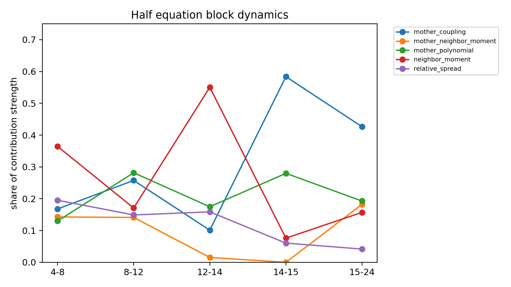

The local-spread matrix $A_sQ$ is not purely diagonal. The most stable channel is $Q_y\to x_{\rm half}$, meaning that local spread in the neighbor $y$-direction repeatedly contributes to the predicted half-separation in the $x$-direction.

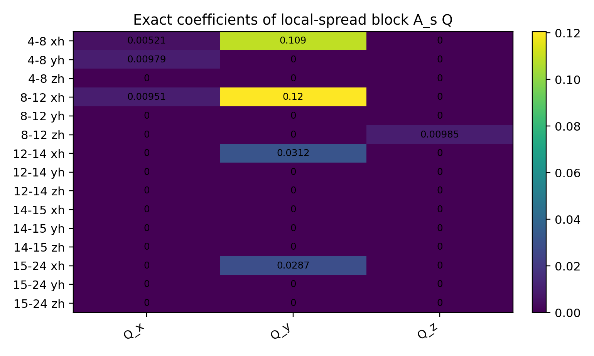

## 6. Stable local-spread channel: Qy to x_half

The strongest target-specific local-spread motif is

$$
Q_y=\langle (y_j-m_y)^2\rangle_N\quad\longrightarrow\quad x_{\rm half}.
$$

This is **not** a universal univariate law. It is better interpreted as a recurring conditional channel inside the sparse multivariate equations.

| stage | n | Pearson r | Spearman r | univariate R2 | partial r | FixedTerm coef |
| --- | --- | --- | --- | --- | --- | --- |
| 4-8 | 888 | -0.094 | 0.051 | 0.009 | 0.151 | 0.109 |
| 8-12 | 872 | 0.405 | 0.288 | 0.164 | 0.124 | 0.120 |
| 12-14 | 436 | 0.437 | 0.399 | 0.191 | -0.122 | 0.031 |
| 14-15 | 186 | 0.148 | 0.147 | 0.022 | -0.121 | — |
| 15-24 | 1674 | 0.581 | 0.617 | 0.338 | 0.515 | 0.029 |

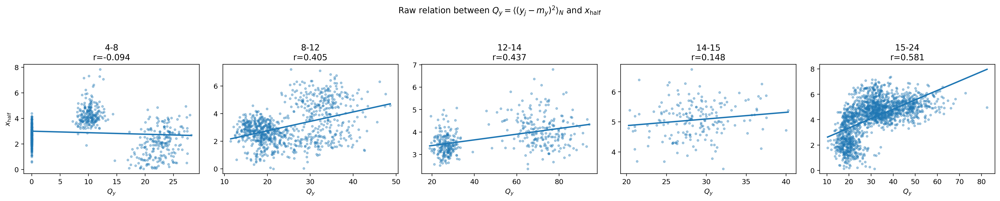

The 14-15 stage is treated as a short transition window rather than a representative source of cross-stage rules.

## 7. Cross-stage transfer and stage-dependent dynamics

The transfer experiments compare two settings:

- **Direct coefficient transfer:** transfer both selected terms and source-stage coefficients to a destination stage.

- **Feature transfer + destination refit:** transfer selected terms only, and refit coefficients on the destination stage.

The result is clear: coefficients are not stable across stages, but selected structures are partially reusable.

| mode | mean_mean_R2 | median_mean_R2 | mean_half_R2 | median_half_R2 | mean_all_R2 | median_all_R2 |
| --- | --- | --- | --- | --- | --- | --- |
| direct coefficients | -7.263 | -1.117 | -137.451 | -8.638 | -72.357 | -8.118 |
| feature transfer + destination refit | 0.784 | 0.935 | 0.244 | 0.201 | 0.514 | 0.571 |

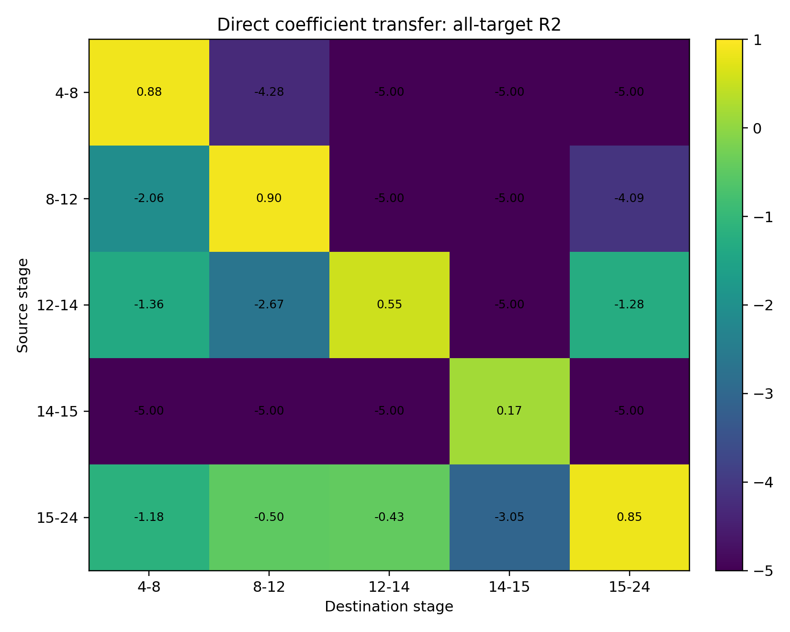

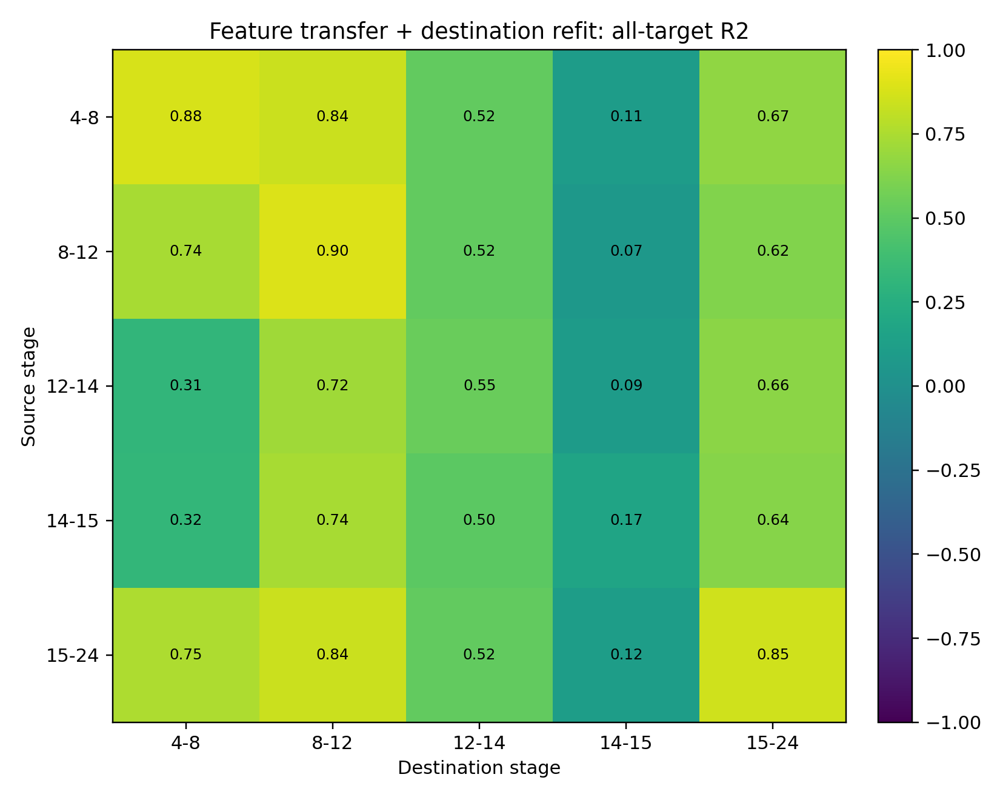

A symmetric stage-similarity view shows that 4-8 and 8-12 are relatively continuous, while the largest break occurs around 12-14 to 14-15.

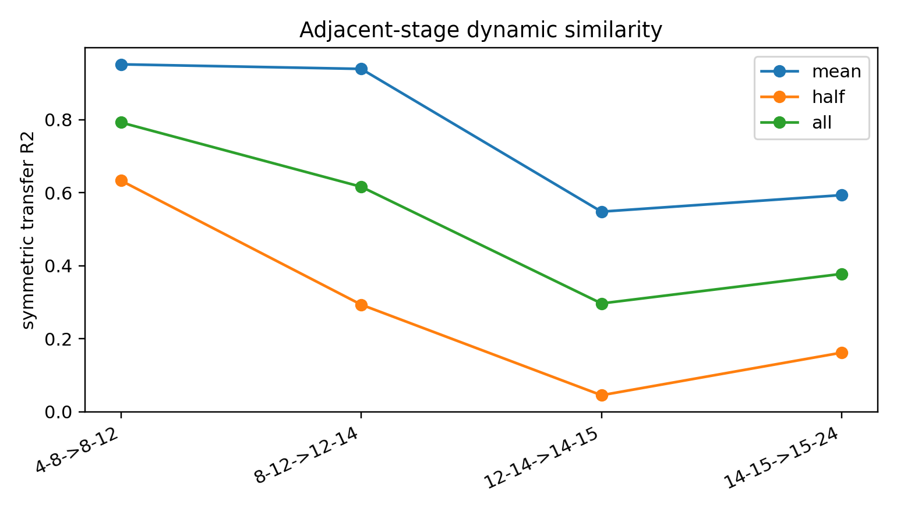

The dynamic interpretation is therefore:

$$
q^{(s)}=\sum_k\beta_{s,k}\phi_k,
$$

where the feature dictionary has cross-stage structure, but the coefficients are stage-specific.

## 8. RandomForest feature audit

RandomForest is used as a nonlinear feature audit, not as the final interpretable model. It checks whether the features selected by FixedTermOLS are also important to a nonlinear model.

| stage | fixedterm_selected_count | rf_top20_count | overlap_count | overlap_fraction_selected |
| --- | --- | --- | --- | --- |
| 4-8 | 21 | 20 | 7 | 0.333 |
| 8-12 | 30 | 20 | 12 | 0.400 |
| 12-14 | 26 | 20 | 11 | 0.423 |
| 14-15 | 22 | 20 | 13 | 0.591 |
| 15-24 | 28 | 20 | 8 | 0.286 |

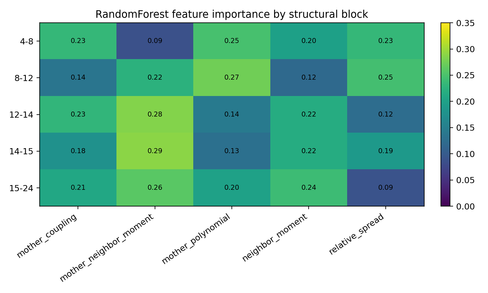

RF supports the importance of the structural feature blocks, including mother-coordinate polynomials, neighbor moments, relative-spread terms, and mother-neighbor couplings. It does not directly prove the target-specific $Q_y\to x_{\rm half}$ channel because RF importance is multi-output and stage-level.

## 9. Few-shot coefficient calibration

The few-shot experiment tests whether a small number of destination-stage samples can calibrate coefficients on a fixed sparse structure. Training sizes are $n_{\rm train}=5,10,20,40,80$. In the latest version, the RandomForest baseline is also reported from $n=5$ onward.

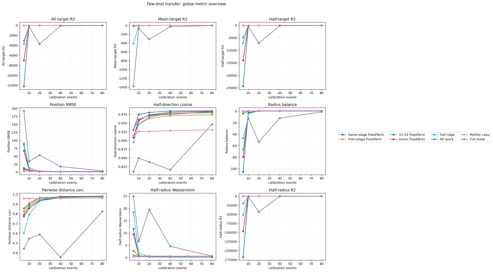

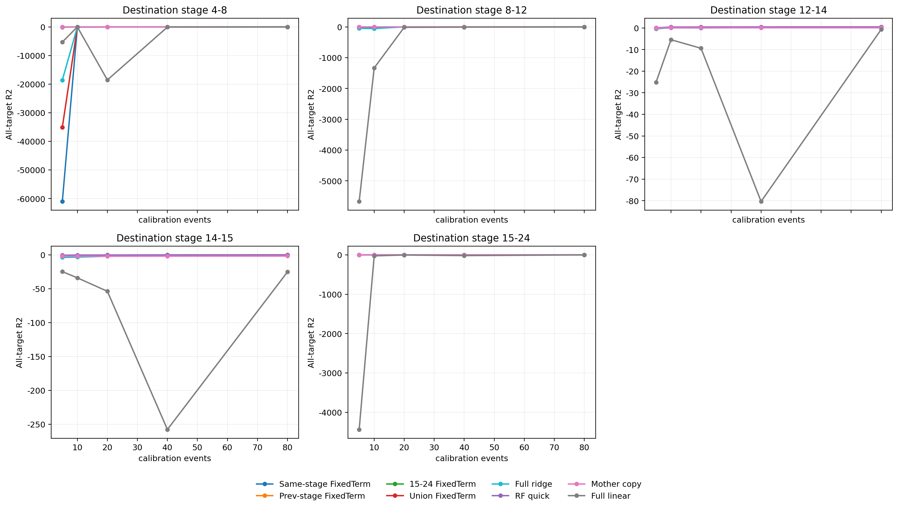

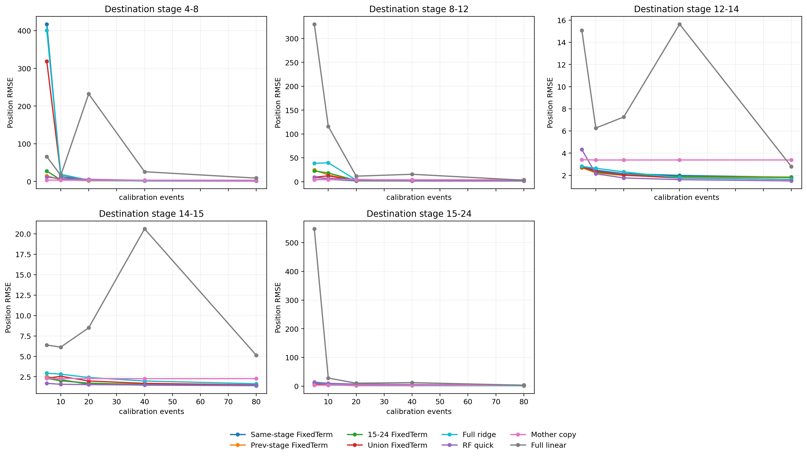

### Global ranking at n=20

| model | all R2 | mean R2 | half R2 | position RMSE | radius balance |
| --- | --- | --- | --- | --- | --- |
| RF quick | 0.458 | 0.627 | 0.288 | 4.202 | 0.461 |
| Prev-stage FixedTerm | 0.361 | 0.706 | 0.016 | 2.485 | 0.797 |
| Same-stage FixedTerm | 0.339 | 0.732 | -0.053 | 2.224 | 0.346 |
| 15-24 FixedTerm | 0.323 | 0.641 | 0.004 | 2.194 | 0.702 |
| Union FixedTerm | 0.108 | 0.649 | -0.433 | 2.521 | 0.397 |
| Full ridge | -0.082 | 0.373 | -0.536 | 3.014 | 0.515 |
| Mother copy | -0.127 | -0.187 | -0.067 | 3.328 | 0.000 |
| Full linear | -3724.407 | -316.961 | -7131.852 | 54.010 | -53.363 |

### Global ranking at n=40

| model | all R2 | mean R2 | half R2 | position RMSE | radius balance |
| --- | --- | --- | --- | --- | --- |
| Same-stage FixedTerm | 0.590 | 0.776 | 0.405 | 1.782 | 0.648 |
| RF quick | 0.536 | 0.725 | 0.347 | 2.861 | 0.381 |
| Union FixedTerm | 0.511 | 0.740 | 0.282 | 1.831 | 0.752 |
| Prev-stage FixedTerm | 0.465 | 0.748 | 0.181 | 2.195 | 0.756 |
| 15-24 FixedTerm | 0.445 | 0.712 | 0.178 | 1.946 | 0.643 |
| Full ridge | 0.341 | 0.610 | 0.072 | 2.057 | 0.795 |
| Mother copy | -0.091 | -0.145 | -0.036 | 3.307 | 0.000 |
| Full linear | -88.211 | -28.209 | -148.213 | 17.988 | -11.894 |

### Global ranking at n=80

| model | all R2 | mean R2 | half R2 | position RMSE | radius balance |
| --- | --- | --- | --- | --- | --- |
| Same-stage FixedTerm | 0.612 | 0.794 | 0.431 | 1.663 | 0.711 |
| RF quick | 0.609 | 0.773 | 0.446 | 2.005 | 0.530 |
| Union FixedTerm | 0.595 | 0.791 | 0.399 | 1.657 | 0.735 |
| Full ridge | 0.537 | 0.758 | 0.315 | 1.768 | 0.815 |
| Prev-stage FixedTerm | 0.510 | 0.766 | 0.254 | 2.088 | 0.760 |
| 15-24 FixedTerm | 0.482 | 0.726 | 0.237 | 1.855 | 0.719 |
| Mother copy | -0.062 | -0.107 | -0.017 | 3.295 | 0.000 |
| Full linear | -6.763 | -2.964 | -10.562 | 4.651 | -1.057 |

The structured FixedTerm models are especially useful in the low-data regime. RandomForest can be competitive in target-wise R2, but the sparse FixedTerm models often provide more stable 3D position error and a clear equation-level interpretation.

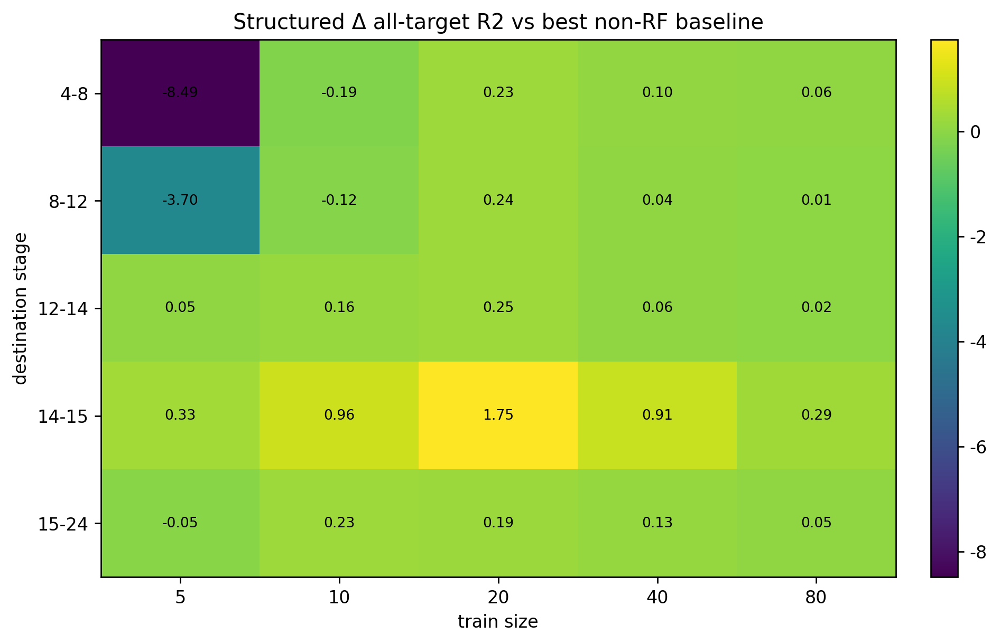

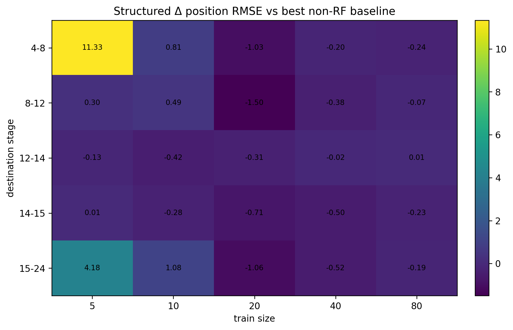

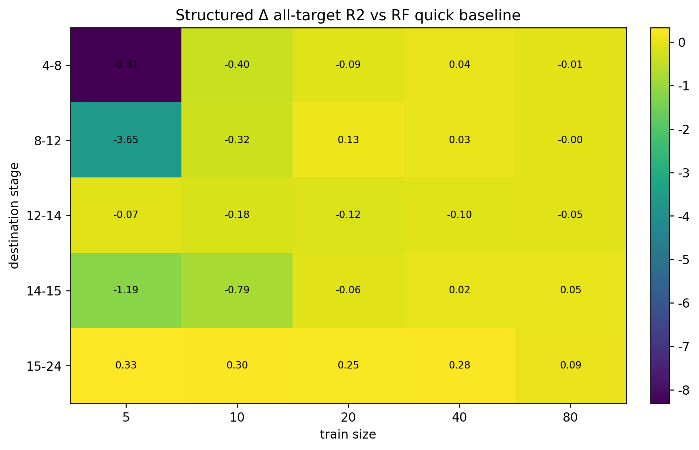

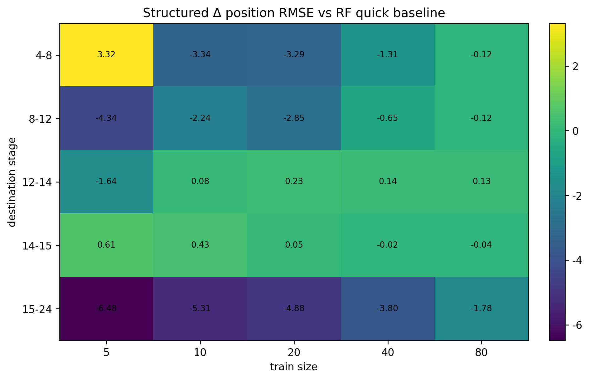

The target-wise heatmap at $n=40$ includes the RF row with no NA entries.

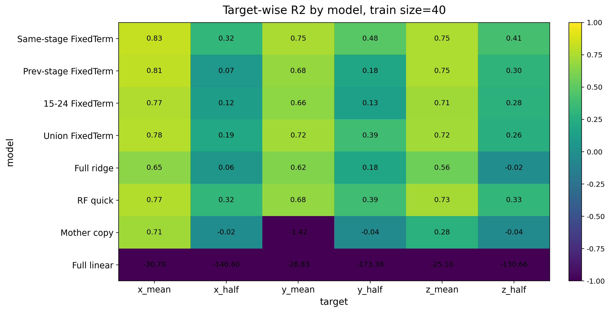

## 10. Interpretation and takeaways

1. **FixedTermOLS is the main model.** It gives sparse equations and stable morphology.

2. **Mean and half targets behave differently.** Mean targets behave like stable center transport; half targets encode local, stage-specific division geometry.

3. **The half-vector has a coherent structure.** The equation blocks shift from local neighbor geometry to stronger mother-axis coupling across development.

4. **Coefficients are stage-specific.** Direct coefficient transfer fails, while feature transfer with refitting is useful.

5. **Few-shot calibration is effective.** Sparse structural priors outperform full-feature linear baselines in low-data settings and remain competitive with RF while preserving interpretability.

6. **14-15 is a transition window.** It is not used as the main source of cross-stage rules.

## 11. Repository guide

- [`docs/all_fixedterm_equations.md`](docs/all_fixedterm_equations.md): complete equations for every stage and target.

- [`docs/key_results_tables.md`](docs/key_results_tables.md): compact result tables.

- [`docs/non_main_explorations.md`](docs/non_main_explorations.md): geometry-correction attempts and non-main motifs.

- [`docs/reproducibility_notes.md`](docs/reproducibility_notes.md): how the analysis pipeline is organized.

- [`assets/figures`](assets/figures): all figures used in this README.

- [`tables`](tables): exported CSV tables used to build the summaries.

